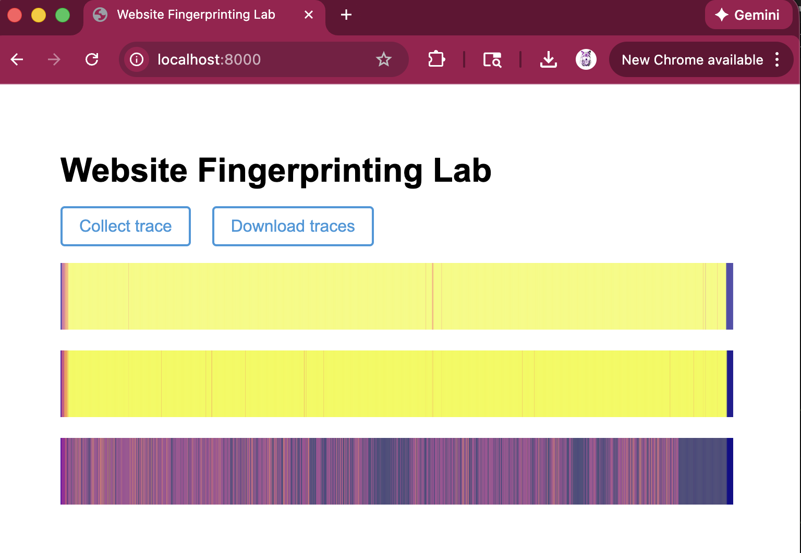

## Optional

**Report your browser version, CPU type, cache size, RAM amount, and OS. We use this information to learn about the attack’s behavior on different machines.**

- Browser:
- CPU:
- Cache sizes:
- RAM:
- OS:


## 1-2

**Use the values printed on the webpage to find the median access time and report your results as follows.**

| Number of Cache Lines | Median Access Latency (ms) |
| --------------------- | -------------------------- |
| 1                     |                            |
| 10                    |                            |
| 100                   |                            |
| 1,000                 |                            |
| 10,000                |                            |
| 100,000               |                            |
| 1,000,000             |                            |
| 10,000,000            |                            |


## 1-3

**According to your measurement results, what is the resolution of your `performance.now()`? In order to measure differences in time with `performance.now()``, approximately how many cache accesses need to be performed?**


## 2-2

**Report important parameters used in your attack. For each sweep operation, you access N addresses, and you count the number of sweep operations within a time interval P ms. What values of N and P do you use? How do you choose N? Why do not you choose P to be larger or smaller?**

We use a timing window of P = 2 ms and an 8 MB buffer accessed with a 64-byte stride, which results in approximately N ≈ 131,072 memory addresses per sweep. We choose N to ensure that each sweep occupies a significant portion of the last-level cache, increasing the likelihood of cache eviction by victim activity. A smaller buffer would reduce cache contention and weaken the signal, while a much larger buffer would increase execution time without improving distinguishability. We do not choose P to be larger because longer windows smooth out short-lived cache activity, and it is not chosen to be smaller because JavaScript timer resolution and system noise would dominate the measurements.


## 2-3

**Take screenshots of the three traces generated by your attack code and include them in the lab report.**




## 2-4

**Use the Python code we provided in Part 2.1 to analyze simple statistics (mean, median, etc.) on the traces from google.com and nytimes.com. Report the statistic numbers.**

https://www.google.com
count 20 trace_len 2500
mean 18.34496 median 19.0 std 2.7443619656306275 min -1.0 max 21.0
https://www.nytimes.com
count 20 trace_len 2500
mean 17.31072 median 18.0 std 2.865179415254828 min -1.0 max 21.0


## 2-6

**Include your classification results in your report.**

```
                           precision    recall  f1-score   support

      https://www.cnn.com       1.00      0.97      0.99        40
   https://www.google.com       1.00      0.68      0.81        40
  https://www.nytimes.com       0.89      1.00      0.94        40
https://www.wikipedia.org       0.82      1.00      0.90        40

                 accuracy                           0.91       160
                macro avg       0.93      0.91      0.91       160
             weighted avg       0.93      0.91      0.91       160
```


## 3-2

**Include your new accuracy results for the modified attack code in your report.**

```
PART 3
                          precision    recall  f1-score   support

      https://www.cnn.com       0.65      0.60      0.62        40
   https://www.google.com       0.80      0.50      0.62        40
  https://www.nytimes.com       0.70      0.70      0.70        40
https://www.wikipedia.org       0.69      1.00      0.82        40

                 accuracy                           0.70       160
                macro avg       0.71      0.70      0.69       160
             weighted avg       0.71      0.70      0.69       160
```


## 3-3

**Compare your accuracy numbers between Part 2 and 3. Does the accuracy decrease in Part 3? Do you think that our “cache-occupancy” attack actually exploits a cache side channel? If not, take a guess as to possible root causes of the modified attack.**

Yes, accuracy drops from 0.91 in Part 2 to 0.70 in Part 3. This suggests the modified “cache-occupancy” version is capturing a weaker or noisier signal. My guess is that without the original eviction-based pattern, the measurements are dominated by CPU scheduling, JIT/GC activity, and other system noise, so the traces still have some site-dependent structure but are not primarily reflecting cache effects.
